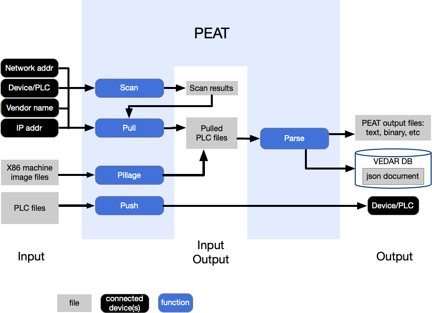

************
Introduction
************

PEAT (Process Extraction and Analysis Tool) is a multifunction utility and library for interrogating and mapping :term:`ICS` and :term:`OT` devices, including network discovery, acquiring and parsing artifacts (firmware, logic, etc.), uploading artifacts, and sending commands. It runs on most systems, including Linux, Windows, macOS, and as a :term:`Docker` :term:`Container`. Refer to :ref:`platforms-section` for full details on supported platforms.

High-level flow
===============

.. _supported-devices:

Supported ICS/OT devices
========================

Description of functions
------------------------

- Scan: discover and identify the device on a network and gather basic information about it (such as the vendor, model and other basic information)
- Pull: actively interrogate devices to retrieve detailed information and artifacts (e.g. configurations, logic, firmware, logs, etc.) from a device via a communication link (Ethernet, serial, etc.).
- Parse: ability to extract information from the device's configuration, programming, or firmware files. This can be file(s) from the device itself or exported from the vendor software used to program the device, with the latter form commonly known as a "project file". The amount of information extracted varies by device and :term:`TRL` level.

CSV files
---------
CSV files for the tables that are listed in the sections that follow.

- Supported devices: :download:`supported_devices.csv <supported_devices.csv>`
- Unintegrated devices: :download:`unintegrated_devices.csv <unintegrated_devices.csv>`
- TCP/IP protocols currently used by PEAT: :download:`tcp_ip_protocols_used_by_peat.csv <tcp_ip_protocols_used_by_peat.csv>`

Included devices
----------------
Devices that are included with PEAT "out of the box" and are fully-integrated as PEAT modules.

.. warning::
   The estimated Technology Readiness Levels (:term:`TRL`) for each module are **estimates only** and are only intended to provide insight into the maturity of a module's development level and reliability

.. csv-table::
   :escape: \
   :file: supported_devices.csv
   :header-rows: 1

Unintegrated devices
--------------------
Devices that have code and some amount of work done for, but are not included with PEAT "out of the box" and aren't yet integrated as PEAT modules. The analysis work is done, they just need a modest amount of development effort to integrate them as PEAT modules.

.. csv-table::
   :escape: \
   :file: unintegrated_devices.csv
   :header-rows: 1

TCP/IP protocols currently used by PEAT
---------------------------------------
.. csv-table::
   :escape: \
   :file: tcp_ip_protocols_used_by_peat.csv
   :header-rows: 1

Why use peat?
=============

Use cases
---------

- Network inventory, enumeration, discovery. Going into a unknown network, what's here? Even on a known system, documentation is often out of date.
- Forensics and incident response. If an incident happened, run PEAT to collect logs, file artifacts, hashes, and carve out memory reads. Was the firmware modified? The logic? Is the config correct and expected? What happened in the logs?
- Monitoring for malicious activity. Regular pulls over time. Compare them using Hipparchus, or analytics and anomaly detection with Archimedes.
- Backups. There are 100 relays, point a PEAT pull at all of them, backup done in 10 minutes. Imagine having to do that individually with SEL aCCelerator...your engineer will be unhappy. And how do you automate that?
- Health monitoring. Ensure the system is healthy and no errors are in the logs. PEAT can help fill the gaps where vendor capabilities are lacking.
- Recovery. PEAT push can upload configs or firmware to bring a device back to a known-good state (if it exists).
- Red Team tool
    - Sneakypeat is a lighter weight PEAT designed to be used for red team exercises.
    - PEAT can be used as a reconnisance tool during red team exercises or engagements.

Why use PEAT instead of Vendor software or other tools?
-------------------------------------------------------

- Immensely difficult or even impossible to automate. Getting data out is hard, let alone operating it.
- Licensing costs/ability (there is vendor software that costs ~$11,000 USD for a SINGLE license).
- Often can't run headless, need a heavy Windows VM, and it's a :term:`GUI` (and that Windows VM needs a license...).
- Automating Windows :term:`GUI` is time consuming and brittle - This is typically just a one-off type of ability that's expensive to develop and maintain.
- Vendor software usually only supports their latest and greatest, older devices require older software, now you have multiple :term:`VM`s...
- Data is limited to what vendor has chosen to implement in this particular software, not what's possible to obtain. They do not (typically) pull down raw meter values, certain configuration values, running process, network states, raw files, file hashes, etc.
- It isn't very portable, and system requirements are heavy (virtualization software, system with resources to run a :term:`VM`, can't do headless)
- Doesn't scale, if you want to pull from 10 power meters at the same time, you'll need 10 :term:`VM`s.
- Performance. PEAT is often faster.
- System load. Few or no ways to limit what data is pulled, it could pull a little or a ton of data, depending on the software, causing undesirable load on the device. PEAT also causes load, but you can configure it to just pull what's needed.
- Standardized output. PEAT standardizes the data so downstream tools and :term:`SIEM` platforms can ingest the data.
  - There is Consistency across vendors by using PEAT
  - The power of a defined data model and standardized schema
- Integration. PEAT has a variety of output formats that are both machine-parsable by other tools, and readable by humans. Additionally, it integrates with Elasticsearch.
- Automation. PEAT is trivial to automate, and in fact has been automated many times in the past.
